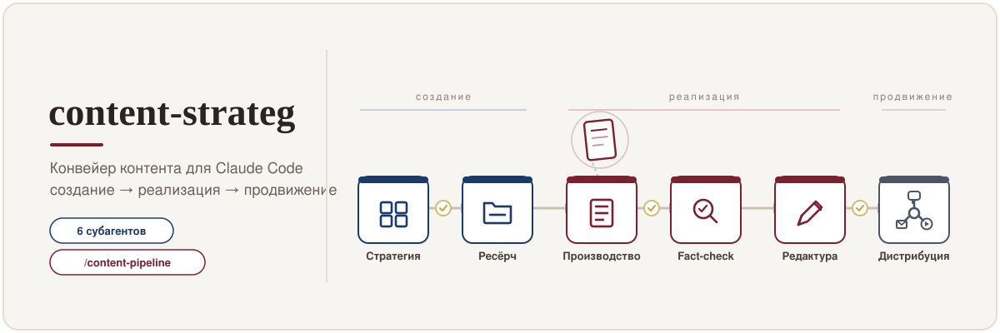

# Конвейер контента content-strateg



> **EN — TL;DR.** A Russian-language **content-pipeline framework for Claude Code**: six specialized
> sub-agents (strategist → researcher → producer → fact-checker → expert review → editor → distributor)
> orchestrated by a single `/content-pipeline` command, with a human checkpoint after every stage.
> Editorial methodology, source-hierarchy rules, fact-checking and publishing guardrails live in
> `CLAUDE.md`. Drop the `.claude/` and `templates/` folders into your project, adapt `CLAUDE.md`,
> and fill `brand/personal.md`. Docs below are in Russian. Licensed CC BY 4.0.

---

**content-strateg** — методология и набор субагентов для Claude Code, превращающие создание
контента в управляемый конвейер: от стратегии до готового к публикации пакета материалов под
несколько площадок. Система ничего не публикует сама — она доводит материал до готового текста и
человеческого ревью.

## Что это

Метафора — **конвейер («контент-завод»)**. Материал последовательно проходит роли, на каждой
стадии его ведёт отдельный субагент, а после каждой стадии — пауза на ваше «да». Передача между
стадиями идёт через файлы проекта; состояние фиксируется в `pipeline.md`.

## Архитектура

Шесть субагентов (`.claude/agents/`) + дирижёр-команда (`.claude/commands/content-pipeline.md`):

```
strategist → researcher → producer → fact-checker → expert_review → editor → distributor
 создание      сбор        реализация    проверка     (человек,       редактура  продвижение
 стратегии    фактуры                     §5          право вето)
```

| Агент | Роль | Модель |
|-------|------|--------|
| `content-strategist` | стратегии и контент-планы (контент не пишет) | opus |
| `content-researcher` | `research.md` по иерархии источников | sonnet |
| `content-producer` | артефакты из шаблонов | opus |
| `fact-checker` | аудит фактов/норм/цитат/URL (текст не переписывает) | opus |
| `content-editor` | редактура L1–L4, сохранение оригинала | opus |
| `content-distributor` | репурпозинг и план дистрибуции (не публикует) | sonnet |

**Экспертное ревью** — человеческая стадия: если редполитика клиента требует ревью эксперта с
правом вето (медицинский/юридический/финансовый контент), дирижёр блокирует «готово», пока
решение не зафиксирует владелец. Ни один агент не имитирует экспертное «добро».

## Структура папок

```
content-strateg/
├── CLAUDE.md                  # методология и правила (главный документ)
├── brand/personal.md          # профиль личного бренда владельца (заполнить)
├── clients/_template/         # образец клиентской папки
├── research/sources.md        # реестр доверенных источников
├── strategies/  plans/        # стратегии и контент-планы
├── projects/                  # один проект = одна папка (brief, research, артефакты, pipeline)
├── templates/                 # 14 шаблонов артефактов — единственный источник форматов
└── .claude/
    ├── agents/                # 6 субагентов
    └── commands/              # дирижёр /content-pipeline
```

## Установка

1. Скопируйте в свой проект Claude Code папки `.claude/` и `templates/`, файл `CLAUDE.md`,
   а также каркасы `brand/`, `clients/`, `research/`, `projects/`, `strategies/`, `plans/`.
2. Адаптируйте `CLAUDE.md` под себя: персона, темы экспертизы, тон (все места помечены `[?? ...]`).
3. Заполните `brand/personal.md` (личный бренд) и при необходимости `research/sources.md`.
4. Для клиентских проектов — создайте `clients/<slug>/profile.md` (контракт; без него работа
   по клиенту не стартует) и, если нужно, биндинг-редполитику `clients/<slug>/editorial-policy.md`.

## Запуск

- **Весь конвейер:** `/content-pipeline <запрос>` — дирижёр определяет контур (личный/клиент),
  создаёт папку проекта, ведёт стадии и ждёт «да» после каждой.
- **Отдельная роль:** вызвать нужного субагента напрямую (например, только редактуру или ресёрч).

## Классы контента и проверка качества

- **Класс 1 — экспертный**, **класс 2 — коммерческий**, **класс 3 — трендовый**.
- Для классов 1–2 fact-check обязателен; артефакт не «готов», пока `fact_check: passed`.
- Иерархия источников и запрет фабрикации — в `CLAUDE.md` §5; реестр — `research/sources.md`.

## Безопасность

- **Запрет публикации.** Конвейер заканчивается готовым текстом и ревью владельца; ни один агент
  не публикует, не рассылает и не активирует автоматизации (`CLAUDE.md` §6).
- Защита от prompt injection, конфиденциальность клиентов, запрет хранения секретов — там же.

## Лицензия

[CC BY 4.0](LICENSE). При использовании указывайте авторство и ссылку на репозиторий.
